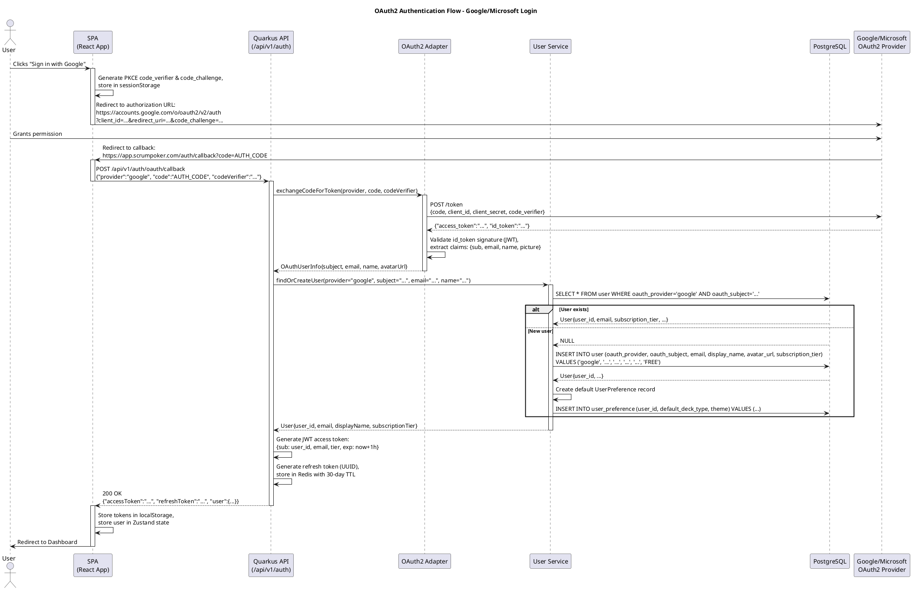

# Task Briefing Package

This package contains all necessary information and strategic guidance for the Coder Agent.

---

## 1. Current Task Details

This is the full specification of the task you must complete.

```json
{
  "task_id": "I3.T2",
  "iteration_id": "I3",
  "iteration_goal": "Implement OAuth2 authentication (Google, Microsoft), JWT token generation/validation, user registration/login flows, and frontend authentication UI to enable secured access to the application.",
  "description": "Create `JwtTokenService` for JWT access token and refresh token management. Implement token generation: create access token with claims (sub: userId, email, roles, tier, exp: 1 hour), create refresh token (UUID stored in Redis with 30-day TTL). Implement token validation: verify signature (RSA key), check expiration, extract claims. Implement token refresh: validate refresh token from Redis, generate new access token, rotate refresh token. Use SmallRye JWT library. Store RSA private key in application config (production: Kubernetes Secret), public key for validation.",
  "agent_type_hint": "BackendAgent",
  "inputs": "JWT authentication requirements from architecture blueprint, SmallRye JWT Quarkus extension patterns, Token lifecycle (access 1 hour, refresh 30 days)",
  "input_files": [
    ".codemachine/artifacts/architecture/05_Operational_Architecture.md"
  ],
  "target_files": [
    "backend/src/main/java/com/scrumpoker/security/JwtTokenService.java",
    "backend/src/main/java/com/scrumpoker/security/TokenPair.java",
    "backend/src/main/java/com/scrumpoker/security/JwtClaims.java",
    "backend/src/main/resources/privateKey.pem",
    "backend/src/main/resources/publicKey.pem"
  ],
  "deliverables": "JwtTokenService with methods: `generateTokens(User)`, `validateAccessToken(String)`, `refreshTokens(String refreshToken)`, RSA key pair generation script (openssl commands in README), Access token with claims: sub, email, roles, tier, exp, iat, Refresh token storage in Redis with TTL, Token rotation on refresh (invalidate old refresh token, issue new one)",
  "acceptance_criteria": "Generated access token validates successfully, Token includes correct user claims (userId, email, subscription tier), Expired token validation throws JwtException, Refresh token lookup succeeds from Redis, Token rotation invalidates old refresh token, Signature validation uses RSA public key correctly",
  "dependencies": [],
  "parallelizable": true,
  "done": false
}
```

---

## 2. Architectural & Planning Context

The following are the relevant sections from the architecture and plan documents, which I found by analyzing the task description.

### Context: authentication-mechanisms (from 05_Operational_Architecture.md)

```markdown
##### Authentication Mechanisms

**OAuth2 Social Login (Free/Pro Tiers):**
- **Providers:** Google OAuth2, Microsoft Identity Platform
- **Flow:** Authorization Code Flow with PKCE (Proof Key for Code Exchange) for browser-based clients
- **Implementation:** Quarkus OIDC extension handling token exchange and validation
- **Token Storage:** JWT access tokens (1-hour expiration) in browser `localStorage`, refresh tokens (30-day expiration) in `httpOnly` secure cookies
- **User Provisioning:** Automatic user creation on first login with `oauth_provider` and `oauth_subject` as unique identifiers
- **Profile Sync:** Email, display name, and avatar URL synced from OAuth provider on each login

**Enterprise SSO (Enterprise Tier):**
- **Protocols:** OIDC (OpenID Connect) and SAML2 support via Quarkus Security extensions
- **Configuration:** Per-organization SSO settings stored in `Organization.sso_config` JSONB field (IdP endpoint, certificate, attribute mapping)
- **Domain Enforcement:** Email domain verification ensures users with `@company.com` email automatically join organization workspace
- **Just-In-Time (JIT) Provisioning:** User accounts created on first SSO login with organization membership pre-assigned
- **Session Management:** SSO sessions synchronized with IdP via backchannel logout or session validation

**Anonymous Play:**
- **Identifier:** Client-generated UUID stored in browser `sessionStorage` for session continuity
- **Room Association:** Anonymous participants linked to room via `RoomParticipant.anonymous_id`
- **Feature Restrictions:** No session history access, no saved preferences, no administrative capabilities
- **Data Lifecycle:** Anonymous session data purged 24 hours after room inactivity
```

### Context: authorization-strategy (from 05_Operational_Architecture.md)

```markdown
##### Authorization Strategy

**Role-Based Access Control (RBAC):**
- **Roles:** `ANONYMOUS`, `USER`, `PRO_USER`, `ORG_ADMIN`, `ORG_MEMBER`
- **Implementation:** Quarkus Security annotations (`@RolesAllowed`) on REST endpoints and service methods
- **JWT Claims:** Access token includes `roles` array for authorization decisions
- **Dynamic Role Mapping:** Subscription tier (`FREE`, `PRO`, `PRO_PLUS`, `ENTERPRISE`) mapped to roles during token generation

**Resource-Level Permissions:**
- **Room Access:**
  - `PUBLIC` rooms: Accessible to anyone with room ID
  - `INVITE_ONLY` rooms: Requires room owner to whitelist participant (Pro+ tier)
  - `ORG_RESTRICTED` rooms: Requires organization membership (Enterprise tier)
- **Room Operations:**
  - Host controls (reveal, reset, kick): Room creator or user with `HOST` role in `RoomParticipant`
  - Configuration updates: Room owner only
  - Vote casting: Participants with `VOTER` role (excludes `OBSERVER`)
- **Report Access:**
  - Free tier: Session summary only (no round-level detail)
  - Pro tier: Full session history with round breakdown
  - Enterprise tier: Organization-wide analytics with member filtering

**Enforcement Points:**
1. **API Gateway/Ingress:** JWT validation and signature verification
2. **REST Controllers:** Role-based annotations reject unauthorized requests with `403 Forbidden`
3. **WebSocket Handshake:** Token validation before connection upgrade
4. **Service Layer:** Domain-level checks (e.g., room privacy mode enforcement, subscription feature gating)
```

### Context: application-security (from 05_Operational_Architecture.md)

```markdown
##### Application Security

**Input Validation:**
- **REST APIs:** Bean Validation (JSR-380) annotations on DTOs, automatic validation in Quarkus REST layer
- **WebSocket Messages:** Zod schema validation on client, server-side JSON schema validation before deserialization
- **SQL Injection Prevention:** Parameterized queries via Hibernate Reactive, no dynamic SQL concatenation
- **XSS Prevention:** React automatic escaping for user-generated content, CSP (Content Security Policy) headers

**Authentication Security:**
- **JWT Signature:** RS256 (RSA with SHA-256) algorithm, private key stored in Kubernetes Secret
- **Token Expiration:** Short-lived access tokens (1 hour), refresh tokens rotated on use
- **OAuth2 State Parameter:** CSRF protection for OAuth flow, state validated on callback
- **PKCE:** Protects authorization code from interception in browser-based flows

**Authorization Security:**
- **Least Privilege:** Default deny policy, explicit role grants required for resource access
- **Resource Ownership Validation:** Service layer verifies user owns/has permission for requested resource (e.g., room, report)
- **Rate Limiting:** Redis-backed token bucket algorithm:
  - Anonymous users: 10 req/min per IP
  - Authenticated users: 100 req/min per user
  - WebSocket messages: 50 msg/min per connection

**Data Protection:**
- **Encryption at Rest:** PostgreSQL Transparent Data Encryption (TDE) for sensitive columns (email, payment metadata)
- **PII Handling:** User emails hashed in logs, full values only in database and audit logs
- **Secrets Management:** Kubernetes Secrets for database credentials, OAuth client secrets, JWT signing keys
- **Payment Security:** Stripe tokenization for card details, no PCI-sensitive data stored in application database
```

### Context: oauth-login-flow (from 04_Behavior_and_Communication.md)

```markdown
#### Key Interaction Flow: OAuth2 Authentication (Google/Microsoft)

##### Description

This sequence demonstrates the OAuth2 authorization code flow for user authentication via Google or Microsoft identity providers, JWT token generation, and session establishment.

##### Diagram (PlantUML)


```

### Context: task-i3-t2 (from 02_Iteration_I3.md)

```markdown
*   **Task 3.2: Implement JWT Token Service (Generation & Validation)**
    *   **Task ID:** `I3.T2`
    *   **Description:** Create `JwtTokenService` for JWT access token and refresh token management. Implement token generation: create access token with claims (sub: userId, email, roles, tier, exp: 1 hour), create refresh token (UUID stored in Redis with 30-day TTL). Implement token validation: verify signature (RSA key), check expiration, extract claims. Implement token refresh: validate refresh token from Redis, generate new access token, rotate refresh token. Use SmallRye JWT library. Store RSA private key in application config (production: Kubernetes Secret), public key for validation.
    *   **Agent Type Hint:** `BackendAgent`
    *   **Inputs:**
        *   JWT authentication requirements from architecture blueprint
        *   SmallRye JWT Quarkus extension patterns
        *   Token lifecycle (access 1 hour, refresh 30 days)
    *   **Input Files:**
        *   `.codemachine/artifacts/architecture/05_Operational_Architecture.md` (authentication section)
    *   **Target Files:**
        *   `backend/src/main/java/com/scrumpoker/security/JwtTokenService.java`
        *   `backend/src/main/java/com/scrumpoker/security/TokenPair.java` (DTO: accessToken, refreshToken)
        *   `backend/src/main/java/com/scrumpoker/security/JwtClaims.java` (DTO for token claims)
        *   `backend/src/main/resources/privateKey.pem` (RSA private key, NOT committed to git)
        *   `backend/src/main/resources/publicKey.pem` (RSA public key)
    *   **Deliverables:**
        *   JwtTokenService with methods: `generateTokens(User)`, `validateAccessToken(String)`, `refreshTokens(String refreshToken)`
        *   RSA key pair generation script (openssl commands in README)
        *   Access token with claims: sub, email, roles, tier, exp, iat
        *   Refresh token storage in Redis with TTL
        *   Token rotation on refresh (invalidate old refresh token, issue new one)
    *   **Acceptance Criteria:**
        *   Generated access token validates successfully
        *   Token includes correct user claims (userId, email, subscription tier)
        *   Expired token validation throws JwtException
        *   Refresh token lookup succeeds from Redis
        *   Token rotation invalidates old refresh token
        *   Signature validation uses RSA public key correctly
    *   **Dependencies:** []
    *   **Parallelizable:** Yes (can work parallel with I3.T1)
```

---

## 3. Codebase Analysis & Strategic Guidance

The following analysis is based on my direct review of the current codebase. Use these notes and tips to guide your implementation.

### Relevant Existing Code

*   **File:** `backend/pom.xml`
    *   **Summary:** Contains the complete Maven project configuration with all Quarkus dependencies already configured, including `quarkus-smallrye-jwt` for JWT support (lines 81-84) and `quarkus-redis-client` for Redis operations (lines 68-72).
    *   **Recommendation:** You MUST use the existing SmallRye JWT dependency. The dependency is already configured. No additional dependencies need to be added for JWT functionality.

*   **File:** `backend/src/main/resources/application.properties`
    *   **Summary:** Application configuration file with JWT settings currently commented out (lines 54-69). Contains Redis configuration that is already active (lines 40-50).
    *   **Recommendation:** You MUST uncomment and configure the JWT properties in this file. The placeholders are already provided - you need to set appropriate values. Pay special attention to:
      - `mp.jwt.verify.issuer` - Set to your application's issuer (e.g., "https://scrumpoker.com")
      - `mp.jwt.verify.publickey.location` - Set to "/publicKey.pem"
      - `smallrye.jwt.sign.key.location` - Set to "/privateKey.pem"
      - `mp.jwt.token.expiration` - Set to 3600 (1 hour in seconds)
      - The Redis configuration at lines 40-50 is already functional and should be used for refresh token storage.

*   **File:** `backend/src/main/java/com/scrumpoker/domain/user/User.java`
    *   **Summary:** The User entity class with all fields needed for JWT claims. Contains `userId` (UUID), `email`, `displayName`, `subscriptionTier` (enum at line 59), and OAuth provider information.
    *   **Recommendation:** You MUST use this User entity as input to your `generateTokens(User)` method. The `subscriptionTier` field needs to be mapped to the `tier` claim in the JWT. The `userId` field should be used as the `sub` (subject) claim. Example: `user.subscriptionTier.name()` to get "FREE", "PRO", etc.

*   **File:** `backend/src/main/java/com/scrumpoker/domain/user/SubscriptionTier.java`
    *   **Summary:** Enum defining subscription tiers: FREE, PRO, PRO_PLUS, ENTERPRISE.
    *   **Recommendation:** This enum should be referenced when extracting the tier claim from validated tokens. The tier claim in the JWT should match one of these enum values exactly.

*   **File:** `backend/src/main/java/com/scrumpoker/integration/oauth/OAuth2Adapter.java`
    *   **Summary:** OAuth2 integration adapter following the Strategy pattern with dependency injection using `@ApplicationScoped` and `@Inject` annotations. Demonstrates comprehensive Javadoc, input validation, and logging patterns.
    *   **Recommendation:** You SHOULD follow the same CDI pattern for your JwtTokenService:
      - Use `@ApplicationScoped` for the service bean
      - Use `@Inject` for dependencies like Redis clients
      - Follow the comprehensive Javadoc style
      - Implement thorough input validation at method entry points
      - Use consistent logging with `Logger.getLogger(JwtTokenService.class)`

### Implementation Tips & Notes

*   **Tip:** The project uses Quarkus reactive patterns extensively. While JWT operations may not need to be fully reactive, you SHOULD consider using Mutiny's `Uni<>` return types for Redis operations (refresh token storage/retrieval) to maintain consistency with the reactive programming model used throughout the codebase.

*   **Tip:** For RSA key pair generation, you MUST create a script or document clear instructions. The architecture specifies RSA-256 (RS256) signing. Use OpenSSL commands like:
    ```bash
    # Generate RSA private key (2048 bits)
    openssl genpkey -algorithm RSA -out backend/src/main/resources/privateKey.pem -pkeyopt rsa_keygen_bits:2048

    # Extract public key from private key
    openssl rsa -pubout -in backend/src/main/resources/privateKey.pem -out backend/src/main/resources/publicKey.pem
    ```
    Add these instructions to the backend README.md or create a separate script file like `backend/generate-keys.sh`.

*   **CRITICAL:** The `privateKey.pem` file MUST be added to `.gitignore` to prevent accidentally committing sensitive key material. The `publicKey.pem` can be committed as it's public, but in production both should come from Kubernetes Secrets as specified in the architecture.

*   **Note:** For refresh token storage in Redis, use a key pattern like `refresh_token:{uuid}` where the uuid is the refresh token itself. Store the userId as the value. Set the TTL to 30 days (2592000 seconds). Example pattern:
    ```java
    redis.setex("refresh_token:" + refreshTokenUuid, "2592000", userId.toString());
    ```

*   **Warning:** The SmallRye JWT extension expects specific claim names. Use standard JWT claims:
    - `sub` (subject) for userId (convert UUID to string)
    - `iss` (issuer) for your application identifier (must match `mp.jwt.verify.issuer`)
    - `exp` (expiration) as Unix timestamp (seconds since epoch)
    - `iat` (issued at) as Unix timestamp
    - Custom claims: `email` (String), `roles` (List<String>), `tier` (String matching SubscriptionTier)

*   **Tip:** For role mapping, the architecture specifies dynamic role mapping based on subscription tier. You SHOULD create a helper method that maps `SubscriptionTier` enum to a roles array. Recommended mapping:
    - FREE tier → `["USER"]`
    - PRO tier → `["USER", "PRO_USER"]`
    - PRO_PLUS tier → `["USER", "PRO_USER"]`
    - ENTERPRISE tier → `["USER", "PRO_USER", "ORG_MEMBER"]`

*   **Note:** JWT validation should throw exceptions for invalid tokens. Consider creating custom exceptions like:
    - `ExpiredTokenException extends RuntimeException` - for expired tokens
    - `InvalidSignatureException extends RuntimeException` - for signature validation failures
    - `InvalidTokenException extends RuntimeException` - for malformed tokens
    Or use the built-in SmallRye JWT exceptions if they provide sufficient detail.

*   **Tip:** The Redis client is already configured in application.properties. Inject it using:
    ```java
    @Inject
    RedisDataSource redis;
    ```
    Use the reactive API for key-value operations: `redis.value(String.class)` for Redis string operations.

*   **CRITICAL:** Token rotation on refresh means: when a refresh token is used to generate a new access token, you MUST:
    1. Generate a new refresh token (new UUID)
    2. Delete the old refresh token from Redis
    3. Store the new refresh token in Redis with full 30-day TTL
    4. Return both new access token AND new refresh token
    This prevents refresh token reuse attacks.

*   **Tip:** For token expiration, use Java's `Instant` to calculate expiration times:
    - Access token: `Instant.now().plusSeconds(3600)` (1 hour)
    - Refresh token TTL in Redis: 2592000 seconds (30 days)
    - Convert to Unix timestamp for JWT: `instant.getEpochSecond()`

*   **CRITICAL:** The JWT issuer claim MUST match the configured value in application.properties (`mp.jwt.verify.issuer`). This is a critical security check. Make sure your token generation sets the issuer to match this configuration value exactly.

*   **Note:** The architecture specifies that tokens should be stored in browser localStorage (mentioned in context), but that's a frontend concern. Your service only needs to generate and validate tokens - the storage mechanism is handled by the client.

### Project Conventions

*   **Logging:** The project uses JBoss Logging. Import `org.jboss.logging.Logger` and create a static logger:
    ```java
    private static final Logger LOG = Logger.getLogger(JwtTokenService.class);
    ```
    Log at INFO level for successful operations (token generation, validation), ERROR for failures, DEBUG for detailed diagnostic info.

*   **Exception Handling:** Follow the pattern seen in OAuth2Adapter:
    - Validate inputs at the start of methods
    - Throw `IllegalArgumentException` with descriptive messages for invalid input (null, empty strings)
    - For JWT-specific errors, throw appropriate exceptions or create custom ones
    - Include helpful context in exception messages

*   **Javadoc:** The project requires comprehensive Javadoc comments. Look at OAuth2Adapter.java as the gold standard - every class, method, and parameter should be documented with:
    - Purpose/description
    - @param tags for all parameters with explanations
    - @return tag describing what is returned
    - @throws tags for all exceptions that can be thrown

*   **Package Structure:** Create new classes in `backend/src/main/java/com/scrumpoker/security/` package as specified. This package already exists (confirmed by package-info.java).

*   **Testing:** While not part of this task (I3.T2), be aware that comprehensive unit tests will be required in later iterations. Design your service with testability in mind:
    - Inject dependencies (don't use static methods)
    - Avoid tight coupling
    - Use constructor injection or field injection
    - Make methods mockable

### Critical Security Requirements

*   **CRITICAL:** Never log the full JWT token or refresh token. Only log token metadata like:
    - Token type (access/refresh)
    - User ID associated with token
    - Expiration time
    - First/last few characters (e.g., "abc...xyz") for correlation, never the full token

*   **CRITICAL:** The private key file (privateKey.pem) must NEVER be committed to version control. Add it to .gitignore immediately:
    ```gitignore
    # JWT Private Keys (NEVER COMMIT)
    backend/src/main/resources/privateKey.pem
    ```

*   **CRITICAL:** In production, keys should be loaded from environment variables or Kubernetes Secrets, not from filesystem. Document this requirement clearly in code comments:
    ```java
    // PRODUCTION NOTE: In production environments, keys MUST be loaded from
    // Kubernetes Secrets or environment variables, not from filesystem.
    // The filesystem locations are for development/testing only.
    ```

*   **CRITICAL:** Validate ALL input parameters in every public method. Examples:
    ```java
    if (user == null) {
        throw new IllegalArgumentException("User cannot be null");
    }
    if (token == null || token.trim().isEmpty()) {
        throw new IllegalArgumentException("Token cannot be null or empty");
    }
    ```

*   **CRITICAL:** Set appropriate expiration times that match the architecture specification:
    - Access token: 1 hour (3600 seconds)
    - Refresh token: 30 days (2592000 seconds)
    These are security-critical values - deviating from them affects the security posture.

*   **CRITICAL:** Signature validation MUST use the public key correctly. SmallRye JWT should handle this automatically if configured properly, but verify that:
    - The public key file is readable
    - The key format is correct (PEM format)
    - The algorithm matches (RS256)

### Redis Integration Notes

*   **Tip:** The Redis client in Quarkus supports both blocking and reactive APIs. For consistency with the reactive codebase:
    ```java
    // Reactive approach (recommended)
    Uni<Void> setToken(String refreshToken, UUID userId) {
        return redis.value(String.class)
            .setex("refresh_token:" + refreshToken, 2592000, userId.toString());
    }

    Uni<String> getToken(String refreshToken) {
        return redis.value(String.class)
            .get("refresh_token:" + refreshToken);
    }
    ```

*   **Tip:** For token rotation, use a transaction or pipeline to ensure atomicity:
    1. DELETE old refresh token key
    2. SET new refresh token key with TTL
    This prevents race conditions where both tokens might be valid simultaneously.

*   **Note:** Redis key naming convention should be descriptive and consistent:
    - Prefix: `refresh_token:`
    - Key: The refresh token UUID itself
    - Value: The user ID (UUID as string)
    - Example: `refresh_token:a7b3c9d1-2e4f-5g6h-7i8j-9k0l1m2n3o4p → 12345678-90ab-cdef-1234-567890abcdef`

### SmallRye JWT Integration

*   **Tip:** SmallRye JWT provides `io.smallrye.jwt.build.Jwt` builder for token generation:
    ```java
    String token = Jwt.issuer(issuer)
        .subject(userId.toString())
        .claim("email", user.email)
        .claim("roles", rolesList)
        .claim("tier", user.subscriptionTier.name())
        .expiresAt(expirationTime.getEpochSecond())
        .issuedAt(Instant.now().getEpochSecond())
        .sign();
    ```

*   **Tip:** For token validation, use `JsonWebToken` interface:
    ```java
    @Inject
    JsonWebToken jwt; // This gets populated by SmallRye JWT when validating
    ```
    However, for programmatic validation (not in request context), you may need to use the validation APIs directly.

*   **Warning:** SmallRye JWT configuration in application.properties is critical. The properties MUST be set correctly:
    - `mp.jwt.verify.issuer` - MUST match the issuer claim in generated tokens
    - `mp.jwt.verify.publickey.location` - MUST point to the public key file
    - `smallrye.jwt.sign.key.location` - MUST point to the private key file
    - If these don't match, validation will always fail

*   **Note:** The architecture mentions that in production keys should come from Kubernetes Secrets. Document how to override the file locations with environment variables:
    ```properties
    # Development (default - uses files)
    mp.jwt.verify.publickey.location=/publicKey.pem

    # Production (override with environment variable containing actual key content)
    mp.jwt.verify.publickey=${JWT_PUBLIC_KEY}
    ```
