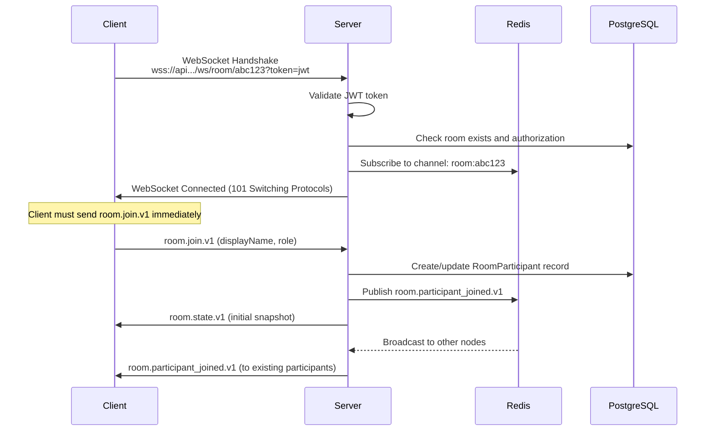
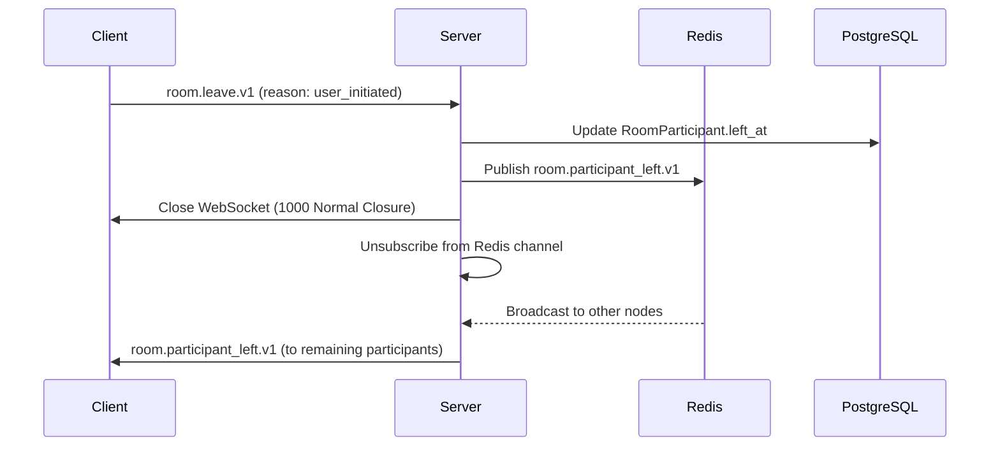
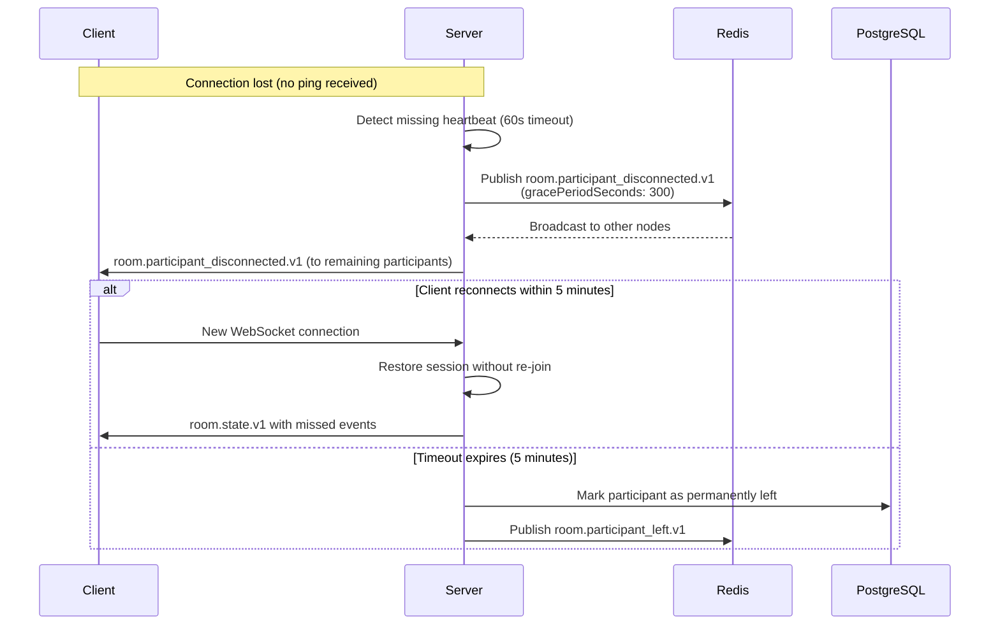

# Planning Poker WebSocket Protocol Specification

**Version:** 1.0
**Last Updated:** 2025-10-17
**Status:** Draft

---

## Table of Contents

1. [Overview](#1-overview)
2. [Message Envelope Format](#2-message-envelope-format)
3. [Message Types](#3-message-types)
4. [Message Schemas](#4-message-schemas)
5. [Connection Lifecycle](#5-connection-lifecycle)
6. [Error Handling](#6-error-handling)
7. [Security](#7-security)
8. [Versioning Strategy](#8-versioning-strategy)
9. [Best Practices](#9-best-practices)
10. [Examples](#10-examples)
11. [Troubleshooting](#11-troubleshooting)

---

## 1. Overview

### 1.1 Purpose

The Planning Poker WebSocket Protocol enables real-time, bidirectional communication for collaborative estimation sessions. This protocol supports:

- Real-time vote casting and vote state updates
- Room state synchronization (participant joins/leaves, host controls)
- Card reveal events with animated timing coordination
- Presence updates (typing indicators, ready states)
- Chat messages and emoji reactions

### 1.2 WebSocket Endpoint

**Endpoint URL Pattern:**
```
wss://api.planningpoker.example.com/ws/room/{roomId}?token={jwt}
```

**Parameters:**
- `{roomId}`: 6-character alphanumeric room identifier (e.g., `abc123`)
- `{jwt}`: JWT access token obtained via OAuth2 authentication flow (query parameter)

**Example:**
```
wss://api.planningpoker.example.com/ws/room/abc123?token=eyJhbGciOiJIUzI1NiIsInR5cCI6IkpXVCJ9...
```

### 1.3 Protocol Characteristics

- **Message Format**: JSON envelopes with `type`, `requestId`, and `payload` fields
- **Communication Style**: JSON-RPC inspired request/response with event broadcasting
- **Event Distribution**: Redis Pub/Sub for horizontal scaling across multiple application nodes
- **Latency Target**: Sub-100ms for vote events and reveals
- **Connection Duration**: Maintained for entire estimation session duration

---

## 2. Message Envelope Format

All WebSocket messages (both client→server and server→client) use a standardized JSON envelope structure.

### 2.1 Envelope Structure

```json
{
  "type": "message_type.v1",
  "requestId": "550e8400-e29b-41d4-a716-446655440000",
  "payload": {
    // Message-specific payload
  }
}
```

### 2.2 Envelope Fields

| Field | Type | Required | Description |
|-------|------|----------|-------------|
| `type` | string | Yes | Versioned message type following pattern: `entity.action.version` (e.g., `vote.cast.v1`) |
| `requestId` | string (UUID v4) | Yes | Unique request identifier for request/response correlation. Clients generate UUIDs for requests; server echoes same ID in responses/broadcasts. |
| `payload` | object | Yes | Message-specific data. Schema depends on message type. May be empty object `{}` for some message types. |

### 2.3 Message Type Naming Convention

Message types follow a semantic versioning pattern:

**Pattern:** `{entity}.{action}.v{version}`

**Examples:**
- `vote.cast.v1` - Cast a vote (version 1)
- `room.join.v1` - Join a room (version 1)
- `round.revealed.v1` - Round revealed event (version 1)
- `error.v1` - Error response (version 1)

**Version Suffix:**
- `.v1`, `.v2`, `.v3`, etc.
- Incremented when payload schema changes in a backward-incompatible way
- Allows multiple versions to coexist during migration periods

---

## 3. Message Types

### 3.1 Client → Server Messages

These messages are sent by clients to the server to initiate actions.

| Message Type | Direction | Description | Host Only |
|--------------|-----------|-------------|-----------|
| `room.join.v1` | Client → Server | Participant joins room (sent immediately after connection) | No |
| `room.leave.v1` | Client → Server | Participant leaves room gracefully | No |
| `vote.cast.v1` | Client → Server | Participant submits vote for current round | No |
| `round.start.v1` | Client → Server | Start new estimation round | **Yes** |
| `round.reveal.v1` | Client → Server | Reveal votes for current round | **Yes** |
| `round.reset.v1` | Client → Server | Reset current round for re-voting | **Yes** |
| `chat.message.v1` | Client → Server | Send chat message to room | No |
| `presence.update.v1` | Client → Server | Update participant presence status | No |

### 3.2 Server → Client Messages

These messages are sent by the server to clients, either as responses or broadcasts.

| Message Type | Direction | Description | Broadcast |
|--------------|-----------|-------------|-----------|
| `room.state.v1` | Server → Client | Initial room state snapshot (sent upon connection) | No (unicast) |
| `room.participant_joined.v1` | Server → Client | Participant joined room | **Yes** |
| `room.participant_left.v1` | Server → Client | Participant left gracefully | **Yes** |
| `room.participant_disconnected.v1` | Server → Client | Participant disconnected ungracefully | **Yes** |
| `vote.recorded.v1` | Server → Client | Vote confirmed (does NOT reveal value) | **Yes** |
| `round.started.v1` | Server → Client | New round started | **Yes** |
| `round.revealed.v1` | Server → Client | Votes revealed with statistics | **Yes** |
| `round.reset.v1` | Server → Client | Round reset | **Yes** |
| `chat.message.v1` | Server → Client | Chat message broadcast | **Yes** |
| `presence.update.v1` | Server → Client | Presence status change | **Yes** |
| `error.v1` | Server → Client | Error response | No (unicast) |

**Broadcast vs. Unicast:**
- **Broadcast**: Message sent to all connected participants in the room via Redis Pub/Sub
- **Unicast**: Message sent only to the requesting client

---

## 4. Message Schemas

All message payload schemas are defined in the companion file: [`websocket-message-schemas.json`](./websocket-message-schemas.json)

This section provides human-readable documentation of each message type.

### 4.1 Client → Server Messages

#### 4.1.1 `room.join.v1`

**Purpose:** Participant joins room. Must be sent immediately after WebSocket connection establishment.

**Payload Schema:**
```json
{
  "displayName": "Alice Smith",       // Required, 1-100 characters
  "role": "VOTER",                    // Required, enum: HOST | VOTER | OBSERVER
  "avatarUrl": "https://..."          // Optional, max 500 characters
}
```

**Example:**
```json
{
  "type": "room.join.v1",
  "requestId": "550e8400-e29b-41d4-a716-446655440000",
  "payload": {
    "displayName": "Alice Smith",
    "role": "VOTER",
    "avatarUrl": "https://example.com/avatar.jpg"
  }
}
```

**Server Response:**
- Success: `room.state.v1` (initial state snapshot)
- Error: `error.v1` with code `4000` (unauthorized), `4001` (room not found), `4003` (forbidden)

---

#### 4.1.2 `room.leave.v1`

**Purpose:** Participant leaves room gracefully. Should be sent before closing WebSocket connection.

**Payload Schema:**
```json
{
  "reason": "user_initiated"          // Optional, enum: user_initiated | timeout | kicked
}
```

**Example:**
```json
{
  "type": "room.leave.v1",
  "requestId": "550e8400-e29b-41d4-a716-446655440000",
  "payload": {
    "reason": "user_initiated"
  }
}
```

**Server Broadcast:**
- `room.participant_left.v1` to all remaining participants

---

#### 4.1.3 `vote.cast.v1`

**Purpose:** Participant casts vote for the current round.

**Payload Schema:**
```json
{
  "cardValue": "5"                    // Required, 1-10 characters, must match current deck
}
```

**Valid Card Values (depends on deck type):**
- Fibonacci: `"0"`, `"1"`, `"2"`, `"3"`, `"5"`, `"8"`, `"13"`, `"21"`, `"?"`
- T-Shirt: `"XS"`, `"S"`, `"M"`, `"L"`, `"XL"`, `"XXL"`, `"?"`
- Powers of 2: `"1"`, `"2"`, `"4"`, `"8"`, `"16"`, `"32"`, `"?"`
- Custom: As defined in room configuration

**Example:**
```json
{
  "type": "vote.cast.v1",
  "requestId": "550e8400-e29b-41d4-a716-446655440000",
  "payload": {
    "cardValue": "5"
  }
}
```

**Server Broadcast:**
- `vote.recorded.v1` to all participants (does NOT include vote value)

**Error Conditions:**
- `4002`: Invalid vote (card value not in deck, no active round, already voted)
- `4003`: Forbidden (observer role cannot vote)

---

#### 4.1.4 `round.start.v1` (Host Only)

**Purpose:** Host starts a new estimation round.

**Payload Schema:**
```json
{
  "storyTitle": "As a user, I want to...",  // Optional, max 500 characters
  "timerDurationSeconds": 120               // Optional, 10-600 seconds
}
```

**Example:**
```json
{
  "type": "round.start.v1",
  "requestId": "550e8400-e29b-41d4-a716-446655440000",
  "payload": {
    "storyTitle": "As a user, I want to login with Google OAuth2",
    "timerDurationSeconds": 120
  }
}
```

**Server Broadcast:**
- `round.started.v1` to all participants

**Error Conditions:**
- `4003`: Forbidden (only HOST role can start rounds)
- `4005`: Invalid state (round already in progress)

---

#### 4.1.5 `round.reveal.v1` (Host Only)

**Purpose:** Host triggers reveal of votes for the current round.

**Payload Schema:**
```json
{}  // Empty payload
```

**Example:**
```json
{
  "type": "round.reveal.v1",
  "requestId": "550e8400-e29b-41d4-a716-446655440000",
  "payload": {}
}
```

**Server Broadcast:**
- `round.revealed.v1` to all participants with vote values and statistics

**Error Conditions:**
- `4003`: Forbidden (only HOST role can reveal)
- `4005`: Invalid state (no active round, no votes cast, already revealed)

---

#### 4.1.6 `round.reset.v1` (Host Only)

**Purpose:** Host resets current round for re-voting.

**Payload Schema:**
```json
{
  "clearVotes": true                  // Optional, default true
}
```

**Example:**
```json
{
  "type": "round.reset.v1",
  "requestId": "550e8400-e29b-41d4-a716-446655440000",
  "payload": {
    "clearVotes": true
  }
}
```

**Server Broadcast:**
- `round.reset.v1` to all participants

**Error Conditions:**
- `4003`: Forbidden (only HOST role can reset)
- `4005`: Invalid state (no active round)

---

#### 4.1.7 `chat.message.v1`

**Purpose:** Participant sends chat message to room.

**Payload Schema:**
```json
{
  "message": "Hello team!",                           // Required, 1-2000 characters
  "replyToMessageId": "550e8400-e29b-41d4-a716-..."   // Optional, UUID of message being replied to
}
```

**Example:**
```json
{
  "type": "chat.message.v1",
  "requestId": "550e8400-e29b-41d4-a716-446655440000",
  "payload": {
    "message": "I think 8 points is too high for this story."
  }
}
```

**Server Broadcast:**
- `chat.message.v1` to all participants with sender details and message ID

---

#### 4.1.8 `presence.update.v1`

**Purpose:** Participant updates presence status.

**Payload Schema:**
```json
{
  "status": "ready",                  // Required, enum: ready | away | typing
  "customMessage": "At lunch"         // Optional, max 100 characters
}
```

**Example:**
```json
{
  "type": "presence.update.v1",
  "requestId": "550e8400-e29b-41d4-a716-446655440000",
  "payload": {
    "status": "away",
    "customMessage": "At lunch, back in 15 mins"
  }
}
```

**Server Broadcast:**
- `presence.update.v1` to all participants

---

### 4.2 Server → Client Messages

#### 4.2.1 `room.state.v1` (Unicast)

**Purpose:** Server sends initial room state snapshot upon connection. Sent in response to `room.join.v1`.

**Payload Schema:**
```json
{
  "roomId": "abc123",
  "title": "Sprint 42 Planning",
  "config": {
    "deckType": "fibonacci",
    "customDeck": null,
    "timerEnabled": true,
    "timerDurationSeconds": 120,
    "allowObservers": true
  },
  "participants": [
    {
      "participantId": "user-123",
      "displayName": "Bob Jones",
      "avatarUrl": "https://...",
      "role": "HOST",
      "connectedAt": "2025-10-17T10:00:00Z",
      "hasVoted": false
    }
  ],
  "currentRound": {
    "roundId": "550e8400-e29b-41d4-a716-446655440000",
    "roundNumber": 3,
    "storyTitle": "User authentication",
    "startedAt": "2025-10-17T10:05:00Z",
    "revealed": false,
    "revealedAt": null
  },
  "lastEventId": "660f9511-f9ac-23e4-b827-537725551111"
}
```

**When Sent:**
- Immediately after client sends `room.join.v1` and server validates authorization

---

#### 4.2.2 `room.participant_joined.v1` (Broadcast)

**Purpose:** Broadcast when a new participant joins the room.

**Payload Schema:**
```json
{
  "participantId": "user-456",
  "displayName": "Alice Smith",
  "avatarUrl": "https://...",
  "role": "VOTER",
  "connectedAt": "2025-10-17T10:10:00Z"
}
```

**When Sent:**
- After a participant successfully joins (broadcast to all existing participants)

---

#### 4.2.3 `room.participant_left.v1` (Broadcast)

**Purpose:** Broadcast when a participant leaves gracefully.

**Payload Schema:**
```json
{
  "participantId": "user-456",
  "leftAt": "2025-10-17T10:30:00Z",
  "reason": "user_initiated"          // enum: user_initiated | timeout | kicked
}
```

**When Sent:**
- After participant sends `room.leave.v1`
- When server times out a participant (no heartbeat)
- When host kicks a participant

---

#### 4.2.4 `room.participant_disconnected.v1` (Broadcast)

**Purpose:** Broadcast when a participant disconnects ungracefully (network failure).

**Payload Schema:**
```json
{
  "participantId": "user-456",
  "disconnectedAt": "2025-10-17T10:30:00Z",
  "gracePeriodSeconds": 300           // 5 minutes to reconnect
}
```

**When Sent:**
- When server detects missing heartbeat and marks connection as stale
- Participant has 5 minutes (grace period) to reconnect before being marked as permanently left

---

#### 4.2.5 `vote.recorded.v1` (Broadcast)

**Purpose:** Broadcast when a vote is recorded. Does NOT include the actual vote value (hidden until reveal).

**Payload Schema:**
```json
{
  "participantId": "user-456",
  "votedAt": "2025-10-17T10:15:00Z",
  "hasVoted": true
}
```

**When Sent:**
- After server persists a vote to the database
- Broadcast to all participants to update UI (show that participant has voted)

**Important:** Vote value is NOT included to maintain secrecy until reveal.

---

#### 4.2.6 `round.started.v1` (Broadcast)

**Purpose:** Broadcast when a new round starts.

**Payload Schema:**
```json
{
  "roundId": "550e8400-e29b-41d4-a716-446655440000",
  "roundNumber": 4,
  "storyTitle": "Implement dark mode",
  "startedAt": "2025-10-17T10:20:00Z",
  "timerDurationSeconds": 120
}
```

**When Sent:**
- After host sends `round.start.v1` and server creates new round

---

#### 4.2.7 `round.revealed.v1` (Broadcast)

**Purpose:** Broadcast when votes are revealed with statistics.

**Payload Schema:**
```json
{
  "roundId": "550e8400-e29b-41d4-a716-446655440000",
  "revealedAt": "2025-10-17T10:22:00Z",
  "votes": [
    {
      "participantId": "user-123",
      "displayName": "Alice Smith",
      "cardValue": "5",
      "votedAt": "2025-10-17T10:21:30Z"
    },
    {
      "participantId": "user-456",
      "displayName": "Bob Jones",
      "cardValue": "8",
      "votedAt": "2025-10-17T10:21:45Z"
    }
  ],
  "statistics": {
    "average": 6.5,
    "median": 6.5,
    "mode": "5",
    "consensusReached": false,
    "totalVotes": 2,
    "distribution": {
      "5": 1,
      "8": 1
    }
  }
}
```

**When Sent:**
- After host sends `round.reveal.v1`
- Server calculates statistics and broadcasts to all participants

**Statistics Fields:**
- `average`: Mean of numeric votes (null if no numeric votes)
- `median`: Median of numeric votes (null if no numeric votes)
- `mode`: Most frequent vote value
- `consensusReached`: Boolean indicating if variance is below threshold
- `totalVotes`: Count of votes in round
- `distribution`: Map of card value to count

---

#### 4.2.8 `round.reset.v1` (Broadcast)

**Purpose:** Broadcast when a round is reset.

**Payload Schema:**
```json
{
  "roundId": "550e8400-e29b-41d4-a716-446655440000",
  "resetAt": "2025-10-17T10:25:00Z",
  "votesCleared": true
}
```

**When Sent:**
- After host sends `round.reset.v1`

---

#### 4.2.9 `chat.message.v1` (Broadcast)

**Purpose:** Broadcast chat message to all room participants.

**Payload Schema:**
```json
{
  "messageId": "770f9511-f9ac-23e4-b827-537725551111",
  "participantId": "user-123",
  "displayName": "Alice Smith",
  "message": "I think 8 points is reasonable for this story.",
  "sentAt": "2025-10-17T10:18:00Z",
  "replyToMessageId": null
}
```

**When Sent:**
- After participant sends `chat.message.v1`

---

#### 4.2.10 `presence.update.v1` (Broadcast)

**Purpose:** Broadcast presence status change.

**Payload Schema:**
```json
{
  "participantId": "user-456",
  "status": "away",
  "customMessage": "At lunch",
  "updatedAt": "2025-10-17T10:30:00Z"
}
```

**When Sent:**
- After participant sends `presence.update.v1`

---

#### 4.2.11 `error.v1` (Unicast)

**Purpose:** Server error response to client request.

**Payload Schema:**
```json
{
  "code": 4002,
  "error": "INVALID_VOTE",
  "message": "Card value '13' is not valid for deck type 'tshirt'",
  "timestamp": "2025-10-17T10:15:00Z",
  "details": {
    "validValues": ["XS", "S", "M", "L", "XL", "XXL", "?"]
  }
}
```

**When Sent:**
- In response to any client message that fails validation or authorization
- `requestId` in error message matches `requestId` of failed request

**See Section 6 for complete error code catalog.**

---

## 5. Connection Lifecycle

### 5.1 Connection Establishment



**Steps:**

1. **WebSocket Handshake**
   - Client initiates: `wss://api.planningpoker.example.com/ws/room/{roomId}?token={jwt}`
   - Server validates JWT token, extracts user/participant identity
   - Server checks room existence and user authorization (privacy mode enforcement)

2. **Server Setup**
   - Server subscribes connection to Redis Pub/Sub channel: `room:{roomId}`
   - WebSocket connection established (HTTP 101 Switching Protocols)

3. **Room Join**
   - Client **MUST** send `room.join.v1` message immediately after connection
   - Server validates join request, creates/updates `RoomParticipant` record
   - Server broadcasts `room.participant_joined.v1` event to existing participants
   - Server sends `room.state.v1` (initial state snapshot) to newly connected client

**Timeout:** If client does not send `room.join.v1` within 10 seconds, server closes connection with code 4008 (policy violation).

---

### 5.2 Heartbeat Protocol

**Purpose:** Detect stale connections and maintain connection liveness.

**Protocol:**
- Client sends WebSocket `ping` frame every **30 seconds**
- Server responds with `pong` frame
- Connection terminated if no `ping` received within **60 seconds** (2x interval)

**Important:** This uses native WebSocket ping/pong frames, NOT custom JSON messages.

**JavaScript Example:**
```javascript
// Most WebSocket libraries handle ping/pong automatically
// If manual implementation needed:
const ws = new WebSocket(url);

setInterval(() => {
  if (ws.readyState === WebSocket.OPEN) {
    ws.ping(); // Send ping frame
  }
}, 30000); // Every 30 seconds

ws.on('pong', () => {
  console.log('Heartbeat received');
});
```

---

### 5.3 Graceful Disconnection



**Steps:**

1. Client sends `room.leave.v1` message before closing connection
2. Server persists disconnection timestamp in `RoomParticipant` table
3. Server broadcasts `room.participant_left.v1` to remaining participants
4. Server closes WebSocket with code 1000 (normal closure)
5. Server unsubscribes from Redis channel if no more local connections to room

**Best Practice:** Always send `room.leave.v1` before closing connection to enable graceful cleanup.

---

### 5.4 Ungraceful Disconnection (Network Failure)



**Steps:**

1. Server detects missing heartbeat (no ping within 60 seconds)
2. Server marks connection as stale
3. Server broadcasts `room.participant_disconnected.v1` with 5-minute grace period
4. **Reconnection Window**: 5 minutes for client to reconnect

**If client reconnects within 5 minutes:**
- Session restored without requiring `room.join.v1`
- Server sends `room.state.v1` with `lastEventId` to replay missed events
- Participant votes remain valid

**If timeout expires:**
- Participant marked as permanently left
- `room.participant_left.v1` broadcast with `reason: timeout`
- Votes remain valid for historical data

---

### 5.5 Reconnection Strategy (Client-Side)

**Recommended Client Implementation:**

1. **Detect Connection Loss**
   - Listen for WebSocket `onclose` event
   - Check if closure was unexpected (code ≠ 1000)

2. **Exponential Backoff**
   - Attempt reconnection with delays: 1s, 2s, 4s, 8s, 16s (max)
   - Reset backoff on successful connection

3. **Include Last Event ID**
   - Store `lastEventId` from `room.state.v1` and all broadcast messages
   - Include in reconnection handshake to retrieve missed events
   - Server replays events from Redis or database within 5-minute window

**JavaScript Example:**
```javascript
class RoomWebSocket {
  constructor(roomId, token) {
    this.roomId = roomId;
    this.token = token;
    this.lastEventId = null;
    this.reconnectAttempts = 0;
    this.maxReconnectDelay = 16000; // 16 seconds
    this.connect();
  }

  connect() {
    const url = `wss://api.planningpoker.example.com/ws/room/${this.roomId}?token=${this.token}`;
    this.ws = new WebSocket(url);

    this.ws.onopen = () => {
      console.log('Connected');
      this.reconnectAttempts = 0;

      // Send join message with lastEventId for replay
      this.send({
        type: 'room.join.v1',
        requestId: uuidv4(),
        payload: {
          displayName: 'Alice',
          role: 'VOTER',
          lastEventId: this.lastEventId // For event replay
        }
      });
    };

    this.ws.onmessage = (event) => {
      const message = JSON.parse(event.data);

      // Store lastEventId for reconnection
      if (message.payload && message.payload.lastEventId) {
        this.lastEventId = message.payload.lastEventId;
      }

      this.handleMessage(message);
    };

    this.ws.onclose = (event) => {
      if (event.code !== 1000) {
        // Unexpected closure, attempt reconnection
        this.reconnect();
      }
    };

    this.ws.onerror = (error) => {
      console.error('WebSocket error:', error);
    };
  }

  reconnect() {
    const delay = Math.min(
      1000 * Math.pow(2, this.reconnectAttempts),
      this.maxReconnectDelay
    );
    this.reconnectAttempts++;

    console.log(`Reconnecting in ${delay}ms (attempt ${this.reconnectAttempts})`);

    setTimeout(() => {
      this.connect();
    }, delay);
  }

  send(message) {
    if (this.ws.readyState === WebSocket.OPEN) {
      this.ws.send(JSON.stringify(message));
    }
  }

  handleMessage(message) {
    // Handle different message types
    console.log('Received:', message);
  }
}
```

---

## 6. Error Handling

### 6.1 Error Message Format

All errors are sent as `error.v1` messages with the following payload:

```json
{
  "code": 4002,
  "error": "INVALID_VOTE",
  "message": "Human-readable error message",
  "timestamp": "2025-10-17T10:15:00Z",
  "details": {
    // Optional additional context
  }
}
```

### 6.2 Error Code Catalog

WebSocket application errors use the **4000-4999 range** (distinct from standard WebSocket close codes 1000-1999).

| Code | Error | Description | Recovery Strategy |
|------|-------|-------------|-------------------|
| **4000** | `UNAUTHORIZED` | Invalid or expired JWT token | Refresh token and reconnect with new JWT |
| **4001** | `ROOM_NOT_FOUND` | Room does not exist or has been deleted | Notify user, redirect to room list |
| **4002** | `INVALID_VOTE` | Vote validation failed (invalid card value, no active round, already voted) | Show error to user, allow retry |
| **4003** | `FORBIDDEN` | Insufficient permissions (e.g., observer trying to vote, non-host starting round) | Show permission error, update UI to reflect role |
| **4004** | `VALIDATION_ERROR` | Request payload validation failed | Show field-specific errors, allow correction |
| **4005** | `INVALID_STATE` | Action not valid in current room/round state | Update local state from server, retry if appropriate |
| **4006** | `RATE_LIMIT_EXCEEDED` | Too many messages sent in short time | Throttle client-side message sending |
| **4007** | `ROOM_FULL` | Room has reached participant limit | Notify user, cannot join |
| **4008** | `POLICY_VIOLATION` | Protocol violation (e.g., didn't send room.join.v1 within 10s) | Reconnect with proper handshake |
| **4999** | `INTERNAL_SERVER_ERROR` | Unexpected server error | Retry with exponential backoff |

### 6.3 Standard WebSocket Close Codes

In addition to application error messages, WebSocket connections may be closed with standard codes:

| Code | Name | Description |
|------|------|-------------|
| **1000** | Normal Closure | Graceful disconnection (sent after `room.leave.v1`) |
| **1001** | Going Away | Server shutting down or client navigating away |
| **1008** | Policy Violation | Protocol violation (e.g., missing `room.join.v1`) |
| **1011** | Internal Error | Unexpected server error |

### 6.4 Error Handling Best Practices

**Client-Side:**
1. Always check `message.type === 'error.v1'` in message handler
2. Match `requestId` to correlate errors with requests
3. Display `message` field to users (human-readable)
4. Use `error` field for programmatic error handling
5. Implement retry logic for transient errors (4005, 4999)

**Example Error Handler:**
```javascript
handleMessage(message) {
  if (message.type === 'error.v1') {
    const { code, error, message: errorMsg, details } = message.payload;

    switch (code) {
      case 4000: // UNAUTHORIZED
        this.refreshAuthToken().then(() => this.reconnect());
        break;
      case 4001: // ROOM_NOT_FOUND
        this.showError('Room not found');
        this.navigateToRoomList();
        break;
      case 4002: // INVALID_VOTE
        this.showError(errorMsg);
        break;
      case 4003: // FORBIDDEN
        this.showError('You do not have permission for this action');
        break;
      case 4005: // INVALID_STATE
        this.requestRoomState(); // Refresh state
        break;
      default:
        this.showError('An error occurred: ' + errorMsg);
    }
  }
}
```

---

## 7. Security

### 7.1 Authentication

**JWT Token Authentication:**
- WebSocket endpoint requires valid JWT access token
- Token passed as query parameter: `?token={jwt}`
- Server validates token signature and expiration on connection
- Token payload contains: `{sub: userId, email, tier, exp}`

**Token Lifecycle:**
- Access tokens expire after **15 minutes**
- If token expires during session, server closes connection with code 4000
- Client must refresh token via REST API (`POST /api/v1/auth/refresh`)
- Reconnect with new token

### 7.2 Authorization

**Room-Level Authorization:**
- **Public Rooms**: Anyone with room ID can join
- **Invite-Only Rooms**: Server validates user has been explicitly invited
- **Org-Restricted Rooms**: Server validates user belongs to organization

**Role-Based Actions:**
- `HOST`: All actions (start round, reveal, reset, kick participants)
- `VOTER`: Vote, chat, presence updates
- `OBSERVER`: Chat, presence updates only (cannot vote)

**Server Enforcement:**
- All host-only actions validated server-side
- `error.v1` with code 4003 (FORBIDDEN) returned for unauthorized actions

### 7.3 Privacy & Data Protection

**Vote Secrecy:**
- `vote.recorded.v1` broadcasts do NOT include vote value
- Vote values only revealed when host triggers `round.reveal.v1`
- Prevents vote influencing before reveal

**Chat Message Filtering:**
- Server-side content filtering for profanity (configurable)
- Rate limiting: Max 10 messages per 30 seconds per participant

**Presence Information:**
- Participant list only visible to room members
- Anonymous participants identified by generated display name

### 7.4 Rate Limiting

**Per-Connection Limits:**
- Maximum 100 messages per minute per connection
- Exceeding limit triggers `error.v1` with code 4006
- Connection closed after repeated violations

**Global Limits:**
- Maximum 1000 concurrent connections per room
- Maximum 50 active rooms per authenticated user

---

## 8. Versioning Strategy

### 8.1 Message Type Versioning

**Independent Evolution:**
- Each message type versioned independently (`.v1`, `.v2`, etc.)
- Allows incremental protocol updates without breaking all clients
- Multiple versions can coexist during migration periods

**Version Increments:**
- **Patch changes** (backward compatible): No version increment
  - Example: Adding optional field to payload
  - Example: Clarifying documentation
- **Minor changes** (backward compatible with opt-in): No version increment
  - Example: New optional message type
- **Major changes** (backward incompatible): Version increment required
  - Example: Changing required fields
  - Example: Changing field types or semantics

### 8.2 Migration Strategy

**During Migration Period:**
1. Server supports both old and new versions simultaneously
2. Clients specify supported versions during handshake (future enhancement)
3. Server sends messages in client's preferred version
4. Old version marked deprecated with sunset date

**Example Migration:**
```json
// Version 1 (deprecated)
{
  "type": "vote.cast.v1",
  "payload": {
    "cardValue": "5"
  }
}

// Version 2 (new - adds vote confidence)
{
  "type": "vote.cast.v2",
  "payload": {
    "cardValue": "5",
    "confidence": "high"  // New optional field
  }
}
```

### 8.3 Deprecation Policy

**Deprecation Lifecycle:**
1. **Announcement**: New version released, old version marked deprecated
2. **Support Period**: Both versions supported for minimum **6 months**
3. **Warning Period**: Last **2 months** before sunset, server sends warning messages
4. **Sunset**: Old version removed, clients must upgrade

**Client Detection:**
- Server logs client version usage metrics
- Deprecation warnings sent via server logs (not to clients)

### 8.4 Backward Compatibility Guarantees

**Server Guarantees:**
- Support multiple versions simultaneously during migration
- Never break existing clients without minimum 6-month notice
- Optional fields can be added without version increment

**Client Responsibilities:**
- Ignore unknown fields in payloads (forward compatibility)
- Handle `error.v1` with code 4004 for unsupported message versions
- Monitor release notes for deprecation announcements

---

## 9. Best Practices

### 9.1 Client Implementation Guidelines

**Connection Management:**
- ✅ **DO** implement exponential backoff for reconnections
- ✅ **DO** send `room.leave.v1` before closing connection
- ✅ **DO** store `lastEventId` for event replay on reconnection
- ❌ **DON'T** create multiple WebSocket connections to the same room
- ❌ **DON'T** send messages before receiving `room.state.v1`

**Message Handling:**
- ✅ **DO** validate message types before processing
- ✅ **DO** use `requestId` for request/response correlation
- ✅ **DO** implement timeouts for expected responses (5-10 seconds)
- ❌ **DON'T** assume message order across different types
- ❌ **DON'T** retry failed messages indefinitely

**State Management:**
- ✅ **DO** use optimistic UI updates for vote casting
- ✅ **DO** reconcile local state with server broadcasts
- ✅ **DO** handle out-of-order message delivery
- ❌ **DON'T** trust client-only state without server confirmation
- ❌ **DON'T** cache vote values before reveal

### 9.2 Server Implementation Guidelines

**Event Broadcasting:**
- ✅ **DO** use Redis Pub/Sub for horizontal scaling
- ✅ **DO** include `lastEventId` in broadcasts for replay
- ✅ **DO** persist events for 5-minute replay window
- ❌ **DON'T** broadcast sensitive data (vote values before reveal)
- ❌ **DON'T** assume all connections receive broadcasts synchronously

**Error Handling:**
- ✅ **DO** validate all incoming messages against schemas
- ✅ **DO** return specific error codes for different failure modes
- ✅ **DO** log errors with request context for debugging
- ❌ **DON'T** expose internal error details to clients
- ❌ **DON'T** crash on malformed messages (log and send error response)

### 9.3 Performance Optimization

**Client-Side:**
- Use WebWorkers for message processing in high-traffic rooms
- Batch UI updates to avoid excessive re-renders
- Implement message queuing during temporary disconnections
- Compress large payloads if supported

**Server-Side:**
- Enable WebSocket compression (`permessage-deflate`)
- Use connection pooling for PostgreSQL
- Implement Redis connection multiplexing
- Monitor and alert on message processing latency (target: <50ms p95)

### 9.4 Testing Strategies

**Unit Testing:**
- Test message serialization/deserialization
- Validate all message payloads against JSON schemas
- Test error handling for each error code

**Integration Testing:**
- Test connection lifecycle (connect, join, disconnect)
- Test vote casting and reveal workflow
- Test reconnection with event replay
- Test host actions (start round, reveal, reset)

**Load Testing:**
- Simulate 1000+ concurrent connections per room
- Test Redis Pub/Sub performance under load
- Measure message delivery latency (p50, p95, p99)

---

## 10. Examples

### 10.1 Complete Vote Casting Flow

**Step 1: Client casts vote**
```javascript
// Client sends vote
ws.send(JSON.stringify({
  type: 'vote.cast.v1',
  requestId: '550e8400-e29b-41d4-a716-446655440000',
  payload: {
    cardValue: '5'
  }
}));

// Optimistically update UI
updateUIVoteStatus('pending');
```

**Step 2: Server broadcasts vote recorded**
```json
// All clients receive (including sender)
{
  "type": "vote.recorded.v1",
  "requestId": "550e8400-e29b-41d4-a716-446655440000",
  "payload": {
    "participantId": "user-123",
    "votedAt": "2025-10-17T10:15:30Z",
    "hasVoted": true
  }
}
```

**Step 3: Host reveals votes**
```javascript
// Host sends reveal
ws.send(JSON.stringify({
  type: 'round.reveal.v1',
  requestId: '660f9511-f9ac-23e4-b827-537725551111',
  payload: {}
}));
```

**Step 4: Server broadcasts revealed votes**
```json
// All clients receive
{
  "type": "round.revealed.v1",
  "requestId": "660f9511-f9ac-23e4-b827-537725551111",
  "payload": {
    "roundId": "770f9511-f9ac-23e4-b827-537725551111",
    "revealedAt": "2025-10-17T10:16:00Z",
    "votes": [
      {
        "participantId": "user-123",
        "displayName": "Alice",
        "cardValue": "5",
        "votedAt": "2025-10-17T10:15:30Z"
      },
      {
        "participantId": "user-456",
        "displayName": "Bob",
        "cardValue": "8",
        "votedAt": "2025-10-17T10:15:45Z"
      }
    ],
    "statistics": {
      "average": 6.5,
      "median": 6.5,
      "mode": "5",
      "consensusReached": false,
      "totalVotes": 2,
      "distribution": {
        "5": 1,
        "8": 1
      }
    }
  }
}
```

### 10.2 Connection with Reconnection

**Initial Connection:**
```javascript
const ws = new WebSocket(
  'wss://api.planningpoker.example.com/ws/room/abc123?token=eyJhbGciOi...'
);

ws.onopen = () => {
  // Send join immediately
  ws.send(JSON.stringify({
    type: 'room.join.v1',
    requestId: uuidv4(),
    payload: {
      displayName: 'Alice Smith',
      role: 'VOTER'
    }
  }));
};

ws.onmessage = (event) => {
  const message = JSON.parse(event.data);

  if (message.type === 'room.state.v1') {
    // Store lastEventId for reconnection
    localStorage.setItem('lastEventId', message.payload.lastEventId);

    // Initialize room state
    initializeRoomState(message.payload);
  }
};
```

**Reconnection After Network Failure:**
```javascript
ws.onclose = (event) => {
  if (event.code !== 1000) {
    // Unexpected closure - reconnect
    const lastEventId = localStorage.getItem('lastEventId');

    setTimeout(() => {
      const ws = new WebSocket(
        'wss://api.planningpoker.example.com/ws/room/abc123?token=newToken'
      );

      ws.onopen = () => {
        ws.send(JSON.stringify({
          type: 'room.join.v1',
          requestId: uuidv4(),
          payload: {
            displayName: 'Alice Smith',
            role: 'VOTER',
            lastEventId: lastEventId  // Request replay of missed events
          }
        }));
      };
    }, 2000); // 2 second delay
  }
};
```

### 10.3 Error Handling Example

**Client sends invalid vote:**
```javascript
// Client sends vote with invalid card value
ws.send(JSON.stringify({
  type: 'vote.cast.v1',
  requestId: '550e8400-e29b-41d4-a716-446655440000',
  payload: {
    cardValue: '13'  // Invalid for T-Shirt deck
  }
}));
```

**Server responds with error:**
```json
{
  "type": "error.v1",
  "requestId": "550e8400-e29b-41d4-a716-446655440000",
  "payload": {
    "code": 4002,
    "error": "INVALID_VOTE",
    "message": "Card value '13' is not valid for deck type 'tshirt'",
    "timestamp": "2025-10-17T10:15:00Z",
    "details": {
      "validValues": ["XS", "S", "M", "L", "XL", "XXL", "?"],
      "deckType": "tshirt"
    }
  }
}
```

**Client handles error:**
```javascript
ws.onmessage = (event) => {
  const message = JSON.parse(event.data);

  if (message.type === 'error.v1') {
    const { code, error, message: errorMsg, details } = message.payload;

    if (code === 4002) {
      // Show error to user with valid options
      showError(`Invalid vote: ${errorMsg}`);
      showValidCardOptions(details.validValues);
    }
  }
};
```

---

## 11. Troubleshooting

### 11.1 Common Issues

#### Issue: Connection Immediately Closed

**Symptoms:**
- WebSocket connects but immediately closes with code 1008 or 4008

**Causes & Solutions:**
1. **Didn't send `room.join.v1` within 10 seconds**
   - Solution: Send `room.join.v1` immediately after `onopen` event

2. **Invalid JWT token**
   - Solution: Verify token is not expired, refresh if needed

3. **Room doesn't exist**
   - Solution: Verify room ID is correct, check if room was deleted

#### Issue: Missing Events / Out of Sync

**Symptoms:**
- Client state doesn't match other participants
- Votes not showing as recorded
- Missed reveal event

**Causes & Solutions:**
1. **Network packet loss**
   - Solution: Implement `lastEventId` tracking and request replay on reconnection

2. **Client-side message processing error**
   - Solution: Check console for JavaScript errors, ensure all message types handled

3. **Redis Pub/Sub issue (server-side)**
   - Solution: Check server logs, verify Redis connectivity

#### Issue: Connection Drops Frequently

**Symptoms:**
- WebSocket closes with code 1006 (abnormal closure)
- Frequent reconnections

**Causes & Solutions:**
1. **Heartbeat not implemented**
   - Solution: Ensure client sends ping frames every 30 seconds

2. **Corporate proxy/firewall blocking WebSocket**
   - Solution: Use fallback HTTP long-polling (future enhancement)

3. **Mobile browser backgrounding**
   - Solution: Detect app background/foreground, reconnect on foreground

#### Issue: Vote Not Recorded

**Symptoms:**
- Client sends `vote.cast.v1` but doesn't receive `vote.recorded.v1`

**Causes & Solutions:**
1. **Invalid card value for deck type**
   - Check for `error.v1` with code 4002
   - Verify card value matches room's deck type

2. **No active round**
   - Check for `error.v1` with code 4005
   - Request room state update

3. **Already voted in current round**
   - Check for `error.v1` with code 4002
   - Update UI to reflect vote already cast

#### Issue: Unauthorized Actions

**Symptoms:**
- Receive `error.v1` with code 4003 (FORBIDDEN)

**Causes & Solutions:**
1. **Non-host trying to start/reveal/reset round**
   - Solution: Update UI to disable host-only actions for non-host roles

2. **Observer trying to vote**
   - Solution: Disable voting UI for OBSERVER role

3. **Room privacy mode violation**
   - Solution: Verify user has permission to join room

### 11.2 Debugging Tools

**Client-Side:**
```javascript
// Enable verbose logging
const ws = new WebSocket(url);

ws.addEventListener('open', (event) => {
  console.log('WebSocket opened:', event);
});

ws.addEventListener('message', (event) => {
  console.log('Received:', JSON.parse(event.data));
});

ws.addEventListener('error', (event) => {
  console.error('WebSocket error:', event);
});

ws.addEventListener('close', (event) => {
  console.log('WebSocket closed:', {
    code: event.code,
    reason: event.reason,
    wasClean: event.wasClean
  });
});
```

**Server-Side:**
- Enable WebSocket debug logging in application configuration
- Monitor Redis Pub/Sub channel subscriptions
- Track message processing latency metrics
- Use distributed tracing (OpenTelemetry) for request correlation

**Network Analysis:**
- Use browser DevTools Network tab → WS filter
- Inspect WebSocket frames (both data and control frames)
- Check for ping/pong frames in connection
- Verify message order and timing

### 11.3 Performance Monitoring

**Key Metrics:**
- **Connection Success Rate**: >99.9%
- **Message Delivery Latency**: <100ms p95
- **Reconnection Success Rate**: >95%
- **Vote→Broadcast Latency**: <50ms p95
- **Concurrent Connections**: Monitor per room

**Alerting Thresholds:**
- Connection success rate <99%
- Message latency >200ms p95
- Redis Pub/Sub lag >500ms
- WebSocket connection errors >1% of attempts

---

## Appendix A: Related Documentation

- [REST API Specification (OpenAPI)](./openapi.yaml) - RESTful endpoints for room management, authentication, subscriptions
- [WebSocket Message Schemas (JSON Schema)](./websocket-message-schemas.json) - Machine-readable schema definitions
- [API Design Documentation](../docs/api-design.md) - REST API design principles and authentication flows
- [Architecture Blueprint](../.codemachine/artifacts/architecture/04_Behavior_and_Communication.md) - System architecture and communication patterns

---

## Appendix B: Change Log

| Version | Date | Changes | Author |
|---------|------|---------|--------|
| 1.0 | 2025-10-17 | Initial specification | Planning Poker Team |

---

## Appendix C: Glossary

- **Broadcast**: Message sent to all participants in a room via Redis Pub/Sub
- **Deck Type**: Set of card values used for estimation (Fibonacci, T-Shirt, etc.)
- **Grace Period**: Time window (5 minutes) for participant to reconnect after ungraceful disconnection
- **Heartbeat**: Ping/pong protocol to detect stale connections
- **Host**: Participant with elevated permissions (start round, reveal, reset)
- **Message Envelope**: Wrapper structure containing type, requestId, and payload
- **Observer**: Participant who can view but not vote
- **Optimistic Update**: Client-side UI update before server confirmation
- **Redis Pub/Sub**: Publish/subscribe messaging system for event broadcasting
- **Reveal**: Action that discloses all vote values with statistics
- **Room State**: Complete snapshot of room configuration and current round
- **Round**: Single estimation cycle (start → vote → reveal)
- **Unicast**: Message sent to specific client (not broadcast)
- **Voter**: Participant who can cast votes

---

## Appendix D: Contact & Support

**For Questions or Feedback:**
- Technical Issues: [api-support@planningpoker.example.com](mailto:api-support@planningpoker.example.com)
- Feature Requests: [GitHub Issues](https://github.com/planningpoker/api/issues)
- Documentation: [docs.planningpoker.example.com](https://docs.planningpoker.example.com)

---

*End of WebSocket Protocol Specification*
